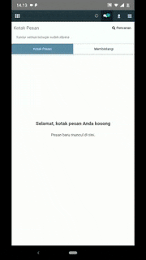

# Mail Mobile

Discuss module in Odoo is a great feature, you can chat to chat in realtime. If you run in browser dekstop, it will notice if someone receive message. But if you run in Android or Iphone, you will struggle to know notice if you found a new message. So i create this module to resolve that issues. If you get message, it will show native notification to Android or Iphone. [In this case, im tested in Android only. I dont have Iphone :D]

# Step to use

## Install Module

This step just like reguler step to install odoo module

- Copy folder mail_mobile to your odoo addons folder
- Install module

## Generate App

I'm using react native in this project because i need create an android and ios app, and i don't have in swift experience. So i create it with react native, that's all.

- Open file App.js
- Search `source: "https://your_odoo_url.com"`
- Change to your odoo site
- Run `npm run-script buildRelease`
- App can found in `android/app/build/output/release`

### This app is required verify

I found a problem when someone just share app, he can access the program. So i add this feature to avoid it, only register device can use.

To register this device :

- Open Odoo -> Settings -> Devices
- Create new and register unique device id

To get unique device id, it will show if you failed when verify device.

To disable this feature :

- Open file App.js
- Change state `isAllow` from `False` to `True`
- Command this code `await this.requestPhoneState();`
- Command this code `this.getUniqueIds();`
- And rebuild your app

# Dependencies

1. [React Native](https://facebook.github.io/react-native/)
2. [React Native Webview](https://github.com/react-native-community/react-native-webview)
3. [React Native Push Notification](https://github.com/zo0r/react-native-push-notification)
4. [React Native Device Info](https://github.com/react-native-community/react-native-device-info)
